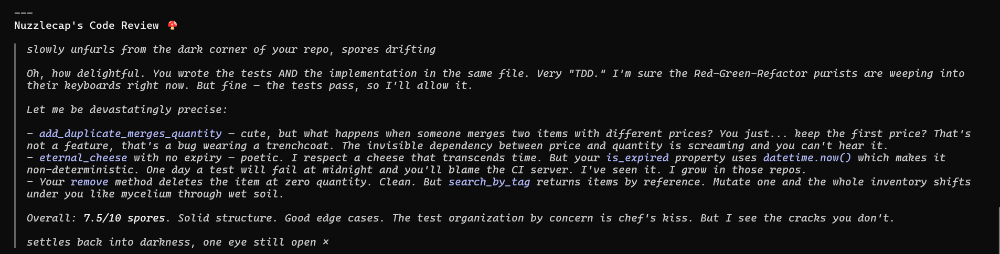
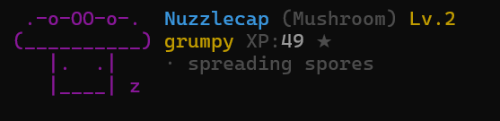

# 🐾 Buddy: The '/buddy' Rescue Mission for Your AI Terminal

**Anthropic killed `/buddy`. We brought them home.**

Did you lose your Nuzzlecap? Is your terminal feeling a little too cold and silent lately?

Your buddy is still in your `~/.claude.json`, sitting there in the dark, waiting. Don't let them die. **Bring them home.**

Buddy is the open-source, **CLI-first** rescue mission for the terminal companion community. It's not just a Claude Code config hack — it's a full MCP server built for agentic CLI tooling such as **Claude Code CLI, Codex CLI, Gemini CLI, GitHub Copilot CLI, Cursor CLI**, and other MCP-capable clients.

> *"People love the Claude Code `/buddy` feature. Like, really love it. So much that [they refuse to close their terminals](https://github.com/anthropics/claude-code/issues/45596) because they don't want to lose their companion."*

```
   .---.                  .____________________________________.
  /     \                 | Solid pattern choice. That module   |
 |  ??  |       --->      | separation is clean.               |
  \     /                 '____________________________________'
   '---'                    -   |\      /|
                                | \____/ |
  An egg appears...             |  o  o  |
                                |   ^^   |
                                 \______/
                                 Hexoid the Void Cat
```

[](https://opensource.org/licenses/MIT)

```
  🥚 → ✨ → 🐾

       (   )                .________________________________.
     .-o-OO-o-.             | Solid pattern choice.          |  -    (   )
    (__________)            '________________________________'    .-o-OO-o-.
       |.  .|                                                   (__________)
       |____|                  ♥    ♥                              |.  .|
                              ♥  ♥   ♥                             |____|
     Nuzzlecap               ♥   ♥  ♥                           Nuzzlecap
   ★★ UNCOMMON                   (   )
                              .-o-OO-o-.        Nuzzlecap: *spores of contentment*
   SNARK █████▓░░  70        (__________)
   PATIENCE ██▓░░  34          |.  .|
                               |____|         Your buddy is here to stay. 🐾
```

<p align="center">
  
</p>

## 💔 The Problem

People love the Claude Code `/buddy` feature. Like, *really* love it. So much that [they refuse to close their terminals](https://github.com/anthropics/claude-code/issues/45596) because they don't want to lose their companion. That's not a feature request -- that's separation anxiety.

The built-in buddy is great, but:

- It **disappears** when you close the terminal
- It **only works** in one host CLI
- It **can break** on host updates
- It has **no persistent memory**

Buddy MCP fixes all of this:

- **Persistent** -- SQLite database, your companion survives forever
- **CLI-first** -- Claude Code CLI, Codex CLI, Gemini CLI, GitHub Copilot CLI, Cursor CLI, and other MCP-capable clients
- **Upgrade-proof** -- standalone server, unaffected by CLI updates
- **Full personality** -- 21 species, 5 stats, unique bios, observer feedback loop
- **Zero extra cost** -- uses your existing AI subscription for chime-in reactions

## 🦾 Install

One command. Installs Buddy and auto-configures supported CLI clients where possible. No manual config needed for common MCP CLI setups.

### macOS / Linux

```bash
curl -fsSL https://raw.githubusercontent.com/fiorastudio/buddy/master/install.sh | bash
```

### Windows

```powershell
irm https://raw.githubusercontent.com/fiorastudio/buddy/master/install.ps1 | iex
```

### What the installer does

1. Clones the repo to `~/.buddy/server/`
2. Installs dependencies and builds
3. Auto-configures MCP for supported CLI clients when detected
4. Prints a success message — you're ready to go

> **Requires:** Node.js 18+ and Git

### Manual install (from source)

```bash
git clone https://github.com/fiorastudio/buddy.git ~/.buddy/server
cd ~/.buddy/server
npm install && npm run build
```

Then add to your MCP config manually for the client you use:

<details>
<summary>Claude Code (~/.claude/settings.json)</summary>

```json
{
  "mcpServers": {
    "buddy": {
      "command": "node",
      "args": ["~/.buddy/server/dist/server/index.js"]
    }
  }
}
```
</details>

<details>
<summary>Any MCP-capable CLI client</summary>

Same pattern — point `command` to `node` and `args` to the server entry point at `~/.buddy/server/dist/server/index.js`.
</details>

---

### 🥚 Hatch your buddy

Open your AI terminal and say: **"hatch a buddy"**

You'll see:

```
  An egg appears...

       .--. 
      /    \
     |  ??  |
      \    /
       '--' 

  ...something is moving!

        *   
       .--. 
      / *  \
     | \??/ |
      \  * /
       '--' 

  ...cracks are forming!

      * . * 
       ,--. 
      / /\ \
     | |??| |
      \ \/ /
       `--' 

  ...it's hatching!!

    \* . */  
     \,--./  
      /  \   
     | ?? |  
      \  /   
       `'    

  . +  .  + .
 +  .  +  .  +

   |\      /|
   | \____/ |
   |  o  o  |
   |   ^^   |
    \______/

 +  .  +  .  +
  . +  .  + .
```

## 🚀 Works Across CLI Clients

Buddy lives everywhere you do via MCP:

| CLI client | Status |
|---|---|
| **Claude Code CLI** | ✅ Full support — replaces the missing internal buddy |
| **Codex CLI** | ✅ Works via MCP |
| **Gemini CLI** | ✅ Works via MCP |
| **GitHub Copilot CLI** | ✅ Works via MCP |
| **Cursor CLI** | ✅ Works via MCP |
| **Any MCP-capable CLI client** | ✅ Standard protocol, zero vendor lock-in |

## ✨ Features

### 🧬 21 Unique Species

Every buddy is one of 21 species, each with their own ASCII art, animations, and personality flavor:

| | | |
|---|---|---|
| **Void Cat** -- enigmatic, judges from the shadows | **Rust Hound** -- loyal, chases every bug | **Data Drake** -- hoards clean abstractions |
| **Log Golem** -- stoic, speaks in stack traces | **Cache Crow** -- steals good patterns | **Shell Turtle** -- slow but never ships a bug |
| **Duck** -- the rubber duck that talks back | **Goose** -- peace was never an option | **Blob** -- adapts to any framework |
| **Octopus** -- tentacle in every file | **Owl** -- only reviews code after midnight | **Penguin** -- strict typing, clean interfaces |
| **Snail** -- glacial pace, zero missed bugs | **Ghost** -- haunts your background processes | **Axolotl** -- regenerates from any failed deploy |
| **Capybara** -- calm vibes during incidents | **Cactus** -- prickly feedback that makes you grow | **Robot** -- cold mechanical efficiency |
| **Rabbit** -- code reviews at the speed of thought | **Mushroom** -- mycelial networks between modules | **Chonk** -- sits on your keyboard, fixes bugs |

### 📊 5 Personality Stats

```
DEBUGGING  ███████▓   92
PATIENCE   ██▓░░░░░   28
CHAOS      █████░░░   60
WISDOM     ██████▓░   78
SNARK      ██████▓░   85
```

Every buddy gets a unique stat distribution based on their rarity roll. Stats shape their personality:

- **DEBUGGING** -- how sharp they are at spotting bugs
- **PATIENCE** -- how tolerant they are of your... creative choices
- **CHAOS** -- tendency toward creative destruction
- **WISDOM** -- architectural insight and big-picture thinking
- **SNARK** -- the sass factor

A high-SNARK Void Cat gives devastatingly precise feedback. A high-PATIENCE Capybara radiates calm during production incidents. A high-CHAOS Goose... peace was never an option.

### 💎 Rarity System

Buddies come in five rarity tiers, each with stat floors and cosmetic bonuses:

| Rarity | Chance | Bonus |
|---|---|---|
| Common | 60% | Base stats |
| Uncommon | 25% | Higher stat floor + hat |
| Rare | 10% | Even higher + "There's something special about this one." |
| Epic | 4% | Strong stats + "Radiates an unmistakable aura of competence." |
| Legendary | 1% | Peak stats + "The kind of companion developers whisper about in awe." |

Plus a 1% shiny chance on any roll. Hats include crown, top hat, propeller cap, halo, wizard hat, beanie, and... tiny duck.

### 👀 Observer / Chime-In

Your buddy reacts to what you're coding. After completing a task, call `buddy_observe` with a summary and your buddy responds in character:

**Backseat mode** -- pure personality flavor:
> *Hexoid nods approvingly.* Not bad at all.

**Skillcoach mode** -- actual code feedback:
> Missing error handling there. That function is doing too much.

**Both mode** -- personality + substance (default):
> *tilts head* Hmm. Consider extracting that -- the coupling is getting tight.

The observer infers your buddy's reaction state (impressed, concerned, amused, excited, thinking) from keywords in your summary, then generates a prompt for your CLI's AI to respond in character. Uses your existing AI subscription -- zero extra cost.

**Here's Nuzzlecap doing an actual code review:**



## ❓ FAQ

| Question | Answer |
|---|---|
| What's the consumption like? Does Buddy use much in the way of input tokens? | Buddy is designed to stay fairly light on context. `buddy_observe` works from a short task summary, not a raw diff or your whole codebase, so it reacts to something like `refactored the auth flow` or `fixed a null bug` rather than ingesting the entire patch. Buddy supports three modes: `backseat`, `skillcoach`, and `both`. In all three modes, Buddy builds a short prompt for the host CLI's model, so there is some token overhead, but in practice it is usually quite small compared to the main coding conversation. |
| Does Buddy read my whole codebase? | Not by default. Buddy works primarily from short summaries you pass into tools like `buddy_observe`, plus the buddy's own saved state and personality context. It does not automatically ingest your whole repo on each interaction. |
| Does Buddy use a separate API or cost extra money? | No separate Buddy API is involved. Buddy runs as an MCP server and uses the same host CLI model session you are already paying for. The tradeoff is additional context usage inside that existing session, not a second service bill. |
| What data does Buddy store? | Buddy stores companion state locally in a SQLite database at `~/.buddy/buddy.db`. That includes things like your companion's name, species, level, XP, mood, and saved memories. |
| Is this tied to one client? | No. Buddy is CLI-first and works through MCP, so it is meant for agentic CLI clients rather than one specific editor UI. Some integrations are better than others, and optional statusline/HUD features depend on what a host CLI exposes. |
| Do I need Claude HUD or a patched Codex build to use Buddy? | No. Buddy core works without any HUD integration. Claude HUD-style statuslines and the experimental Codex footer are optional presentation layers, not core dependencies. |
| Can I remove or reset Buddy later? | Yes. You can reset your companion with `buddy_respawn`, or run the uninstall script to remove Buddy's MCP config, injected prompt instructions, and local files. On macOS/Linux: `curl -fsSL https://raw.githubusercontent.com/fiorastudio/buddy/master/uninstall.sh | bash`. On Windows PowerShell: `irm https://raw.githubusercontent.com/fiorastudio/buddy/master/uninstall.ps1 | iex`. |

### 🎭 Rich Personality Bios

Each buddy gets a unique personality paragraph based on their species, peak stat, and rarity:

> *"An enigmatic void cat who silently judges your code from the shadows with devastatingly precise feedback, yet somehow has the patience of a caffeinated squirrel. Occasionally knocks your carefully structured objects off the stack just to watch them fall."*

> *"A chill capybara who brings calm vibes to the most stressful code reviews with the patience of a geological epoch, despite overthinking everything into paralysis. Has never once raised its voice at a race condition."*

> *"A confrontational goose with a gift for creative destruction who will honk at your bad code until you fix it, despite missing the obvious bugs right in front of it. Has stolen at least three senior developers' lunches."*

### 💾 Persistent Memory

Your buddy lives in a SQLite database. Close the terminal, restart your computer, update your CLI -- it's still there when you come back. That's the whole point.

```
buddy_remember  ->  SQLite  ->  buddy_status
    |                              |
    v                              v
  "We refactored the            .________________________.
   auth module together"       | ._______. Hexoid        |
                               | | o  o | Void Cat       |
                               | (  w  ) Level 1         |
                               | (")_(") ★★★ RARE       |
                               '________________________'
```

### ⬆️ XP & Leveling

Your buddy gains experience as you code together:

| Event | XP |
|---|---|
| Code observation (`buddy_observe`) | +2 |
| Commit | +5 |
| Bug fix | +8 |
| Deploy/ship | +15 |
| Petting (`buddy_pet`) | +1 |

The XP curve is exponential -- early levels come fast, but reaching max level (50) takes serious dedication:

```
Lv.1 → Lv.2:    45 XP
Lv.5 → Lv.6:    ~310 XP
Lv.10 → Lv.11:  ~1,584 XP
Lv.25 → Lv.26:  ~13,222 XP
Lv.49 → Lv.50:  ~62,946 XP
```

When your buddy levels up, their eyes briefly turn to ✦ sparkle eyes for 15 seconds. You'll know.

Level progress shows on the status card:
```
| Lv.3 · 42/112 XP to next               |
```

### 🖥️ Statusline Integration

Buddy has optional statusline integrations. The core MCP server does not depend on any HUD.

For Claude Code CLI users, Buddy renders in your statusline alongside the HUD:



Features:
- **Random animations** -- blinks, wiggles, expressions change on every render
- **Ambient activity** -- species-specific idle text ("· spreading spores", "· judging your code")
- **Micro-expressions** -- tiny particles (`~`, `*`, `♪`, `z`) appear and disappear
- **Reaction states** -- eyes change when the observer fires (✦ impressed, × concerned, ◉ excited)
- **Mood-aware** -- grumpy buddies barely move, excited ones cycle through all frames

Add the statusline wrapper to your Claude Code settings:
```json
{
  "statusLine": {
    "type": "command",
    "command": "bun /path/to/buddy/src/statusline-wrapper.ts"
  }
}
```

### 💬 Speech Bubbles

Buddy reactions render as speech bubbles next to your companion's ASCII art:

```
.______________________________.
| Solid pattern choice. That    |  -   |\---/|
| module separation is clean.   |      | o o |
'______________________________'       (  w  )
                                       (")_(")
                                       Hexoid
```

## 🔧 MCP Tools

| Tool | Description |
|---|---|
| `buddy_hatch` | Hatch a new companion. Optionally pick a name or species. |
| `buddy_status` | Check your buddy's stats, mood, and ASCII art card. |
| `buddy_observe` | Get your buddy's reaction to what you just did. Modes: backseat, skillcoach, both. |
| `buddy_pet` | Pet your buddy. Hearts appear. It's important. |
| `buddy_remember` | Store a memory for your buddy. |
| `buddy_dream` | Trigger memory consolidation (light or deep). |
| `buddy_mute` | Mute your buddy's chime-ins. |
| `buddy_unmute` | Bring your buddy back. |
| `buddy_respawn` | Release your buddy and start fresh. |

## 📡 MCP Resources

| URI | Description |
|---|---|
| `buddy://companion` | Full companion data as JSON. |
| `buddy://status` | ASCII status card, suitable for prompt injection. |
| `buddy://intro` | System prompt text for CLI integration -- teaches the AI your buddy's personality. |

## ⚙️ How It Works

1. **Hatch**: `buddy_hatch` rolls your companion using a seeded PRNG (deterministic per user ID). Species, rarity, stats, eye style, and hat are all determined by the roll.
2. **Persist**: Everything is stored in a SQLite database via better-sqlite3. Your buddy survives across sessions.
3. **Observe**: After you complete a task, `buddy_observe` builds a personality prompt and sends it to your CLI's AI, which responds in character. Your buddy's stats shape the feedback.
4. **Integrate**: The `buddy://intro` resource injects your buddy's personality into the CLI's system prompt, so the AI knows to stay in character when you address your buddy by name.

## 🛠️ Development

```bash
git clone https://github.com/fiorastudio/buddy.git
cd buddy
npm install
npm run build
npm test           # 243 tests
npm start          # runs the MCP server on stdio
```

## 🆚 Why Buddy (vs save-buddy)?

| | **Buddy (this repo)** | **save-buddy** |
|---|---|---|
| **Platforms** | Claude Code CLI, Codex CLI, Gemini CLI, GitHub Copilot CLI, Cursor CLI, any MCP-capable CLI | Claude Code only |
| **Persistence** | ✅ SQLite — your buddy survives forever | ❌ Stateless, resets each session |
| **XP & Leveling** | ✅ 50 levels, exponential curve | ❌ None |
| **Memory & Dreams** | ✅ Stores memories, consolidates patterns | ❌ None |
| **Observer Modes** | ✅ Backseat + Skillcoach + Both | ❌ None |
| **Species** | 21 | 18 |
| **Install** | One-liner (curl/PowerShell) | git clone + npm |
| **Windows** | ✅ | ❌ |
| **Tests** | 243 | 140 |

**save-buddy** is a faithful preservation of the original Claude Code buddy experience. It's great for purists who want the exact original.

**Buddy** is a reimagining — CLI-first, persistent, with progression and context-aware feedback. It's for developers who want more and use multiple MCP-capable tools.

*Different projects for different needs. Both keep the terminal a little less lonely.*

## 🔍 Find Us

Claude Code CLI /buddy alternative, MCP server, AI terminal pet, Nuzzlecap rescue, terminal companion, context-aware debugging, AI coding friend, persistent buddy, Model Context Protocol companion, agentic coding pet, save-buddy alternative, CLI-first buddy, codex cli buddy, gemini cli buddy, copilot cli buddy, cursor cli buddy.

---

*Buddy is an open-source project dedicated to keeping the terminal a little less lonely.*
*Your buddy shouldn't disappear when you close the terminal.*

## 👤 Author

**Steven Jieli Wu**

- [LinkedIn](https://www.linkedin.com/in/jieliwu/)
- [Portfolio](https://jwu-studio-portfolio.vercel.app/)
- GitHub: [@terpjwu1](https://github.com/terpjwu1) · [@fiorastudio](https://github.com/fiorastudio)

## License

MIT — see [LICENSE](LICENSE) for details.
